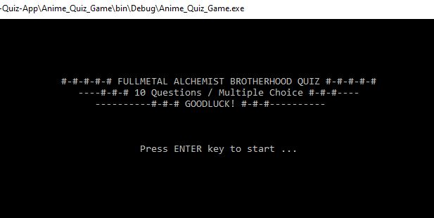

# console-quiz-app

  
A simple anime quiz game subjected to <em>Fullmetal Alchemist Brotherhood</em>, developed using C# Programming Language in  Microsoft Visual Studio 2019.

  &emsp;

  

    <a href="#description">Description</a> •
    <a href="#contribute">Contribute</a>
  

  
  

    <h5>Description</h5>
    The quiz contains 10 trivia questions about Fullmetal Alchemist Brotherhood. 
    The methods/functions for setting the questions and answers are provided, as well as the positioning of the texts in the console.
  

    
  

    <h5>Contribute</h5>
    Pull requests are welcome. Other subjects/topics can also be applied to this console quiz application.
  

